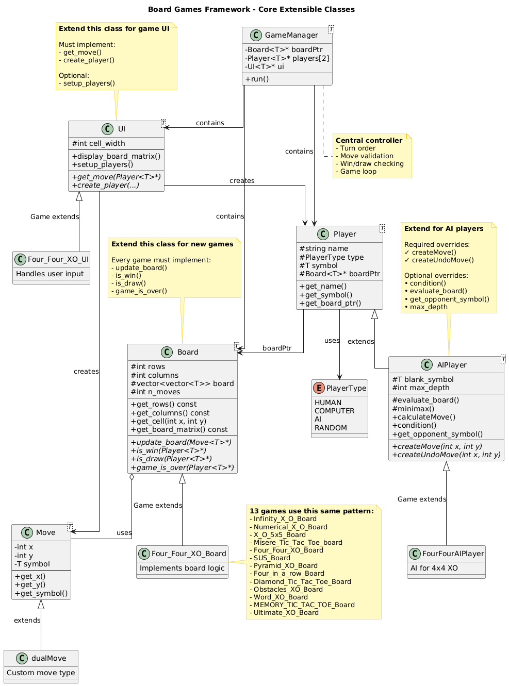

# Board Games Framework

A comprehensive C++ framework for implementing and playing various board games, particularly Tic-Tac-Toe variants. This project demonstrates object-oriented design principles including the Open-Closed Principle (OCP), template patterns, and polymorphism.

## 📋 Table of Contents

- [Overview](#overview)
- [Features](#features)
- [Architecture](#architecture)
- [Games Included](#games-included)
- [Building and Running](#building-and-running)
- [Project Structure](#project-structure)
- [Design Patterns](#design-patterns)
- [AI Implementation](#ai-implementation)
- [Adding New Games](#adding-new-games)
- [Contributing](#contributing)
- [License](#license)

## 🎮 Overview

This project provides a flexible, extensible framework for creating board games. It includes a generic base framework (`BoardGame_Classes.h`) and 13 different game implementations, each demonstrating different gameplay mechanics and AI strategies.

The framework follows the **Open-Closed Principle** - it's open for extension (you can add new games) but closed for modification (the core framework remains unchanged).

### Report
- [Project Report](https://docs.google.com/document/d/1GhDm3uQc0b17LqqxxypT8vBVlTFlVtnRxI1i0f75TiQ/edit?tab=t.0)

## ✨ Features

- **13 Different Games**: Multiple Tic-Tac-Toe variants and board games
- **AI Players**: Intelligent computer players using minimax algorithm with alpha-beta pruning
- **Extensible Architecture**: Easy to add new games by extending base classes
- **Template-based Design**: Generic implementations that work with different symbol types
- **Clean UI**: Console-based interface for each game
- **Polymorphic Design**: Games can share common functionality while having unique behaviors

## 🏗️ Architecture

The project follows a layered architecture:

```
┌─────────────────────────────────────┐
│      Game-Specific Classes          │
│  (13 Game Boards + UI Classes)      │
└─────────────────────────────────────┘
              ↓ extends
┌─────────────────────────────────────┐
│       Framework Core Classes        │
│  (Board, Player, UI, GameManager)   │
└─────────────────────────────────────┘
```

### Core Components

1. **Board<T>**: Abstract base class for game boards
2. **Player<T>**: Base class for game players
3. **Move<T>**: Represents a single move in the game
4. **UI<T>**: Handles user interaction and display
5. **GameManager<T>**: Orchestrates game flow

### AI Components

1. **AIPlayer<T>**: Base AI player class (OCP-compliant)
2. **smartPlayer<T>**: Alternative AI implementation
3. **Game-specific AI players**: Specialized AI for specific games

## 🎯 Games Included

| # | Game Name | Description |
|---|-----------|-------------|
| 1 | Infinity X-O | Standard 3x3 Tic-Tac-Toe game |
| 2 | Numerical X-O | Tic-Tac-Toe where players place numbers that sum to 15 |
| 3 | 5x5 X-O | Larger 5x5 board variant |
| 4 | Misere X-O | Reverse Tic-Tac-Toe (avoid getting 3 in a row) |
| 5 | Four_Four X-O | 4x4 board where pieces can move |
| 6 | SUS Game | Special variant with unique rules |
| 7 | Pyramid XO | Pyramid-shaped board game |
| 8 | Four-in-a-row | Connect Four style game |
| 9 | Diamond Tic-Tac-Toe | Diamond-shaped board variant |
| 10 | Obstacles XO | Tic-Tac-Toe with obstacle pieces |
| 11 | Word XO | Form valid words instead of 3 in a row |
| 12 | Memory Tic-Tac-Toe | Memory-based variant |
| 13 | Ultimate Tic-Tac-Toe | 9x9 meta Tic-Tac-Toe game |

## 🔨 Building and Running

### Prerequisites

- C++17 or later
- CMake 3.10 or later (project configured for CMake 3.29.6+)
- A C++ compiler (GCC, Clang, or MSVC)

### Build Instructions

1. **Clone the repository** (if applicable)
   ```bash
   git clone <repository-url>
   cd Board_Games
   ```

2. **Create build directory**
   ```bash
   mkdir build
   cd build
   ```

3. **Generate build files**
   ```bash
   cmake ..
   ```

4. **Compile the project**
   ```bash
   cmake --build .
   ```
   Or on Unix systems:
   ```bash
   make
   ```

5. **Run the executable**
   ```bash
   ./BoardGameFramework
   ```
   Or on Windows:
   ```bash
   BoardGameFramework.exe
   ```

### Using CMake (Alternative)

If using an IDE like CLion or Visual Studio:
1. Open the project folder
2. Let the IDE configure CMake
3. Build and run from the IDE

## 📁 Project Structure

```
Board_Games/
│
├── include/                      # Header files
│   ├── BoardGame_Classes.h      # Core framework classes
│   ├── AiPlayer.h               # AI player base class (OCP-compliant)
│   ├── Smart_Player.h           # Alternative AI implementation
│   ├── Infinity_XO_Classes.h    # Game 1
│   ├── Numerical_X_O.h          # Game 2
│   ├── X_O_5x5.h                # Game 3
│   ├── Misere_Tic_Tac_Toe.h     # Game 4
│   ├── Four_Four_XO.h           # Game 5 (with AI implementation)
│   ├── SUS_Classes.h            # Game 6
│   ├── Pyramid_XO.h             # Game 7
│   ├── Four-in-a-row.h          # Game 8
│   ├── Diamond_Tic_Tac_Toe.h    # Game 9
│   ├── Obstacles_XO.h           # Game 10
│   ├── Words_XO.h               # Game 11
│   ├── Memory_Tic-Tac-Toe.h     # Game 12
│   └── Ultimate_Tic_Tac_Toe.h   # Game 13
│
├── src/                          # Implementation files
│   ├── main.cpp                 # Entry point with game menu
│   └── [Game]_Classes.cpp       # Game implementations
│
├── docs/                         # Generated documentation
│   ├── html/                    # HTML documentation
│   └── latex/                   # LaTeX documentation
│
├── CMakeLists.txt               # CMake build configuration
├── Doxyfile                     # Doxygen configuration
├── Class_Diagram.puml           # Complete class diagram (PlantUML source)
├── Class_Diagram.png            # Class diagram image
├── Tic_Tac_Toe.puml            # Original class diagram
└── README.md                    # This file
```

## 🎨 Design Patterns

### 1. Template Method Pattern
The `Board<T>`, `Player<T>`, and `UI<T>` classes use templates to work with different symbol types (char, int, etc.).

### 2. Strategy Pattern
Different AI strategies are implemented through the `AIPlayer` and `smartPlayer` classes.

### 3. Factory Pattern
The `UI::create_player()` method acts as a factory for creating different player types.

### 4. Open-Closed Principle
The `AIPlayer` class is designed following OCP:
- **Open for extension**: New games can extend `AIPlayer` and override minimal methods
- **Closed for modification**: The base `AIPlayer` class remains unchanged

## 🤖 AI Implementation

### AIPlayer Base Class

The `AIPlayer<T>` class provides a foundation for intelligent game players:

**Required Overrides:**
- `createMove(int x, int y)`: Create a move at given position
- `createUndoMove(int x, int y)`: Create an undo move for backtracking

**Optional Overrides:**
- `condition(int x, int y)`: Check if position is valid (default: checks blank cells)
- `get_opponent_symbol()`: Get opponent's symbol (default: X/O logic)
- `evaluate_board()`: Evaluate board position (default: simple heuristic)
- `get_max_depth()`: Maximum search depth (default: 3)
- `generate_move_values()`: Generate possible move values (default: single move)

### Example: FourFourAIPlayer

```cpp
class FourFourAIPlayer : public AIPlayer<char> {
    // Only needs to override createMove and createUndoMove
    virtual Move<char>* createMove(int x, int y) override {
        return new dualMove(x, y, this->get_symbol(), current_dy, current_dx);
    }
    
    virtual Move<char>* createUndoMove(int x, int y) override {
        return new dualMove(x + current_dx, y + current_dy, 
                           this->get_symbol(), -current_dy, -current_dx);
    }
};
```

### AI Algorithm

- **Minimax Algorithm**: Evaluates all possible moves
- **Alpha-Beta Pruning**: Optimizes search by eliminating bad branches
- **Depth-Limited Search**: Configurable search depth for performance
- **Heuristic Evaluation**: Position evaluation for non-terminal nodes

## ➕ Adding New Games

To add a new game following OCP:

1. **Create Board Class**
   ```cpp
   class MyGame_Board : public Board<char> {
       // Override required methods
       bool update_board(Move<char>* move) override;
       bool is_win(Player<char>* player) override;
       bool is_lose(Player<char>* player) override;
       bool is_draw(Player<char>* player) override;
       bool game_is_over(Player<char>* player) override;
   };
   ```

2. **Create UI Class**
   ```cpp
   class MyGame_UI : public UI<char> {
       Move<char>* get_move(Player<char>* player) override;
       Player<char>* create_player(string& name, char symbol, PlayerType type) override;
   };
   ```

3. **Optional: Create AI Player**
   ```cpp
   class MyGameAIPlayer : public AIPlayer<char> {
       // Override only createMove and createUndoMove
       Move<char>* createMove(int x, int y) override;
       Move<char>* createUndoMove(int x, int y) override;
   };
   ```

4. **Add to main.cpp**
   ```cpp
   case 14: {
       UI<char>* game_ui = new MyGame_UI();
       Board<char>* board = new MyGame_Board();
       Player<char>** players = game_ui->setup_players();
       GameManager<char> game(board, players, game_ui);
       game.run();
       // Cleanup...
   }
   ```

## 🧪 Testing

To test the games:

1. Compile and run the project
2. Select a game from the menu
3. Choose player types (Human/Computer)
4. Play the game and verify:
   - Move validation works correctly
   - Win conditions are detected
   - Draw conditions are handled
   - AI makes reasonable moves

### Testing AI Players

For games with AI (like Four_Four_XO):
1. Select "Computer" as player type
2. The computer will use minimax algorithm
3. Observe intelligent move selection
4. Verify moves are properly undone after search

## 📊 Class Diagram

### Core Framework Architecture

The diagram below illustrates the main extensible classes that games extend from:



### Key Relationships

- **All game boards** extend `Board<T>` - implement game logic (update_board, is_win, is_draw)
- **All UI classes** extend `UI<T>` - handle user interaction (get_move, create_player)
- **AI players** extend `AIPlayer<T>` - only 2 methods required! (createMove, createUndoMove)
- **Game-specific moves** extend `Move<T>` - for custom move types (optional)

### Viewing the Source

The PlantUML source file is available in `Class_Diagram.puml`. You can view/edit it using:
- **VS Code**: Install "PlantUML" extension, then press `Alt+D` to preview
- **Online**: Copy the `.puml` file content to http://www.plantuml.com/plantuml/uml/
- **Command line**: Use `plantuml Class_Diagram.puml` to regenerate the PNG

## 🤝 Contributing

Contributions are welcome! To contribute:

1. Follow the existing code style
2. Maintain OCP principles
3. Add documentation for new features
4. Test thoroughly before submitting
5. Update this README if adding new games

## 🐛 Known Issues && Possible extensions

- Some games may need additional testing for edge cases
- AI depth can be adjusted per game for optimal performance
- We plan to add a network interface that allows the users to play over the same LAN.

## 📝 License

This project is provided for educational purposes. Please check with the original authors for specific licensing terms.

## 👥 Authors

- **Abdelhamid**
- **Hazem**
- **Adham**
- **Hussien**


## 🙏 Acknowledgments

- Starter Framework by Dr.ElRamly from FCAI 
- AI algorithms inspired by classic game theory
- Design patterns from "Design Patterns: Elements of Reusable Object-Oriented Software"
